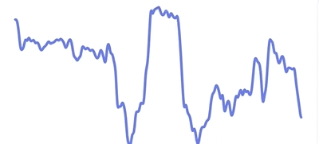
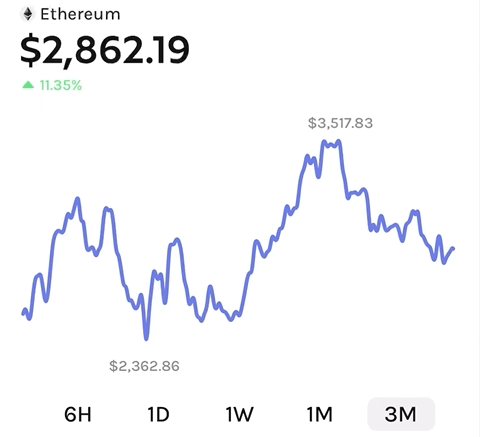
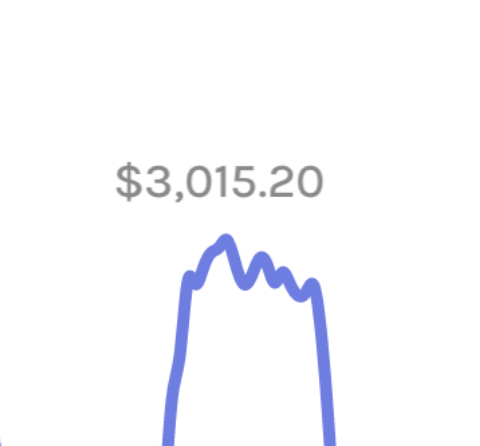
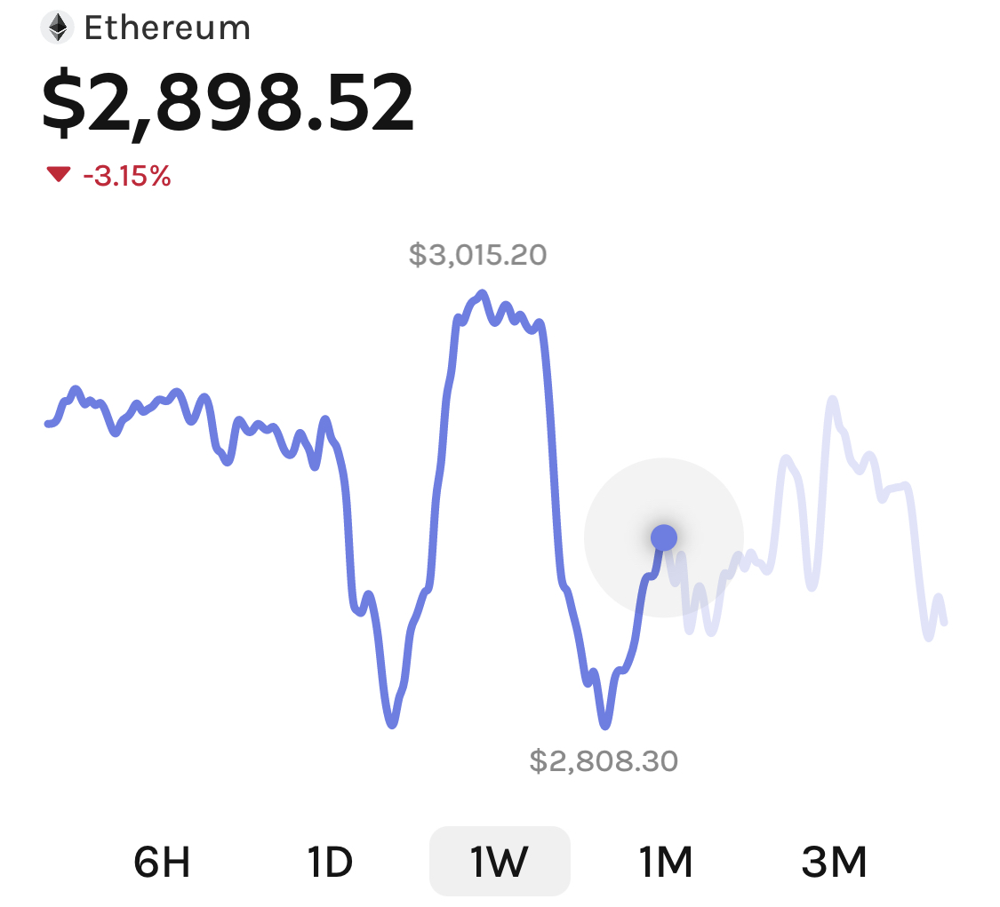

<a href="https://margelo.io">
  
</a>

<div align="center">

  <h2>📈</h2>
  <h2>react-native-graph</h2>
  

  <p>Beautiful, high-performance Graphs/Charts for React Native.</p>

</div>

## Installation

<pre>
yarn add <a href="https://github.com/software-mansion/react-native-reanimated">react-native-reanimated</a>
yarn add <a href="https://github.com/software-mansion/react-native-gesture-handler">react-native-gesture-handler</a>
yarn add <a href="https://github.com/Shopify/react-native-skia">@shopify/react-native-skia</a>
yarn add <b>react-native-graph</b>
</pre>

## Usage

```jsx
function App() {
  const priceHistory = usePriceHistory('ethereum')

  return <LineGraph points={priceHistory} />
}
```

## Configuration

### `animated`


Whether to animate between data changes.

Animations are ran using the [Skia animation system](https://shopify.github.io/react-native-skia/docs/animations/animations) and are fully natively interpolated to ensure best possible performance.

If `animated` is `false`, a light-weight implementation of the graph renderer will be used, which is optimal for displaying a lot of graphs in large lists.

Example:

```jsx
<LineGraph
  points={priceHistory}
  animated={true}
/>
```

---

### `enablePanGesture`



Whether to enable the pan gesture.

>  Requires `animated` to be `true`.

There are three events fired when the user interacts with the graph:

1. `onGestureStart`: Fired once the user presses and holds down on the graph. The pan gesture _activates_.
2. `onPointSelected`: Fired for each point the user pans through. You can use this event to update labels or highlight selection in the graph.
3. `onGestureEnd`: Fired once the user releases his finger and the pan gesture _deactivates_.

Example:

```jsx
<LineGraph
  points={priceHistory}
  animated={true}
  enablePanGesture={true}
  onGestureStart={() => hapticFeedback('impactLight')}
  onPointSelected={(p) => updatePriceTitle(p)}
  onGestureEnd={() => resetPriceTitle()}
/>
```

---

### `TopAxisLabel` / `BottomAxisLabel`



Used to render labels above or below the Graph.

>  Requires `animated` to be `true`.

Usually this is used to render the maximum and minimum values of the Graph. You can get the maximum and minimum values from your graph points array, and smoothly animate the labels on the X axis accordingly.

Example:

```jsx
<LineGraph
  points={priceHistory}
  animated={true}
  TopAxisLabel={() => <AxisLabel x={max.x} value={max.value} />}
  BottomAxisLabel={() => <AxisLabel x={min.x} value={min.value} />}
/>
```

---

### `selectionDotShadowColor`



The color of the selection dot.

>  Requires `animated` and `enablePanGesture` to be `true`.

Example:

```jsx
<LineGraph
  points={priceHistory}
  animated={true}
  enablePanGesture={true}
  selectionDotShadowColor="#333333"
/>
```

## Adopting at scale

react-native-graph was built at Margelo, an elite app development agency. For enterprise support or other business inquiries, contact us at <a href="mailto:hello@margelo.io?subject=Adopting react-native-graph at scale">hello@margelo.io</a>!
