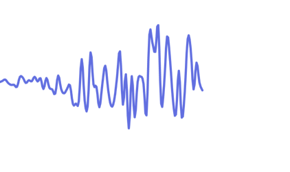

<a href="https://margelo.io">
  
</a>

<div align="center">

  <h1>
    📈 <br/>
    react-native-graph <br/> <br/>
    
  </h1>

  <b>Beautiful, high-performance Graphs/Charts for React Native.</b>
</div>

## About

**react-native-graph** is a Line Graph implementation based on the high performance 2D graphics rendering engine "Skia". It's used in the [Pink Panda Wallet app](https://pinkpanda.io) to power thousands of token graphs every day.

* 🏎️ Faster and smoother than react-native-svg graphs
* ⚡️ Native path interpolation in Skia
* 🐎 Up to 120 FPS animations
* 📈 Cubic bezier rendering for smoother edges
* 👍 Smooth pan/scrubbing gesture
* 💰 Made for crypto apps and Wallets
* ❌ Does not block navigation, press or scroll animations

## Installation

<pre>
yarn add <a href="https://github.com/software-mansion/react-native-reanimated">react-native-reanimated</a>
yarn add <a href="https://github.com/software-mansion/react-native-gesture-handler">react-native-gesture-handler</a>
yarn add <a href="https://github.com/Shopify/react-native-skia">@shopify/react-native-skia</a>
yarn add <b>react-native-graph</b>
</pre>

## Usage

```jsx
function App() {
  const priceHistory = usePriceHistory('ethereum')

  return <LineGraph points={priceHistory} color="#4484B2" />
}
```

## Configuration

### `animated`


Whether to animate between data changes.

Animations are ran using the [Skia animation system](https://shopify.github.io/react-native-skia/docs/animations/animations) and are fully natively interpolated to ensure best possible performance.

If `animated` is `false`, a light-weight implementation of the graph renderer will be used, which is optimal for displaying a lot of graphs in large lists.

Example:

```jsx
<LineGraph
  points={priceHistory}
  animated={true}
  color="#4484B2"
/>
```

---

### `enablePanGesture`


Whether to enable the pan gesture.

>  Requires `animated` to be `true`.

There are three events fired when the user interacts with the graph:

1. `onGestureStart`: Fired once the user presses and holds down on the graph. The pan gesture _activates_.
2. `onPointSelected`: Fired for each point the user pans through. You can use this event to update labels or highlight selection in the graph.
3. `onGestureEnd`: Fired once the user releases his finger and the pan gesture _deactivates_.

The pan gesture can be configured using these props:

1. `panGestureDelay`: Set delay for the pan gesture to activate. Set to `0` to start immediately after touch. Defaults to `300`.

Example:

```jsx
<LineGraph
  points={priceHistory}
  animated={true}
  color="#4484B2"
  enablePanGesture={true}
  onGestureStart={() => hapticFeedback('impactLight')}
  onPointSelected={(p) => updatePriceTitle(p)}
  onGestureEnd={() => resetPriceTitle()}
/>
```

---

### `TopAxisLabel` / `BottomAxisLabel`


Used to render labels above or below the Graph.

>  Requires `animated` to be `true`.

Usually this is used to render the maximum and minimum values of the Graph. You can get the maximum and minimum values from your graph points array, and smoothly animate the labels on the X axis accordingly.

Example:

```jsx
<LineGraph
  points={priceHistory}
  animated={true}
  color="#4484B2"
  TopAxisLabel={() => <AxisLabel x={max.x} value={max.value} />}
  BottomAxisLabel={() => <AxisLabel x={min.x} value={min.value} />}
/>
```

### `Range`



Used to define a range for the graph canvas

This range has to be bigger than the span of the provided data points. This feature can be used, e.g. if the graph should show a fixed timeframe, whether there's data for that period or not.

<br />
<br />

This example shows data in the timeframe between 01/01/2000 to 01/31/2000 and caps the value between 0 and 200:

```jsx
<LineGraph
  points={priceHistory}
  animated={true}
  color="#4484B2"
  enablePanGesture={true}
  range={{
    x: {
      min: new Date(new Date(2000, 1, 1).getTime()),
      max: new Date(
        new Date(2000, 1, 1).getTime() +
        31 * 1000 * 60 * 60 * 24
      )
    },
    y: {
      min: 0,
      max: 200
    }
  }}
/>
```

---

### `SelectionDot`


Used to render the selection dot.

>  Requires `animated` and `enablePanGesture` to be `true`.

If `SelectionDot` is missing or `undefined`, a default one is provided with an outer ring and light shadow.

Example:

```jsx
<LineGraph
  points={priceHistory}
  animated={true}
  color="#4484B2"
  enablePanGesture={true}
  SelectionDot={CustomSelectionDot}
/>
```

See this [example `<SelectionDot />` component](./example/src/components/CustomSelectionDot.tsx).

## Sponsor


**react-native-graph** is sponsored by [Pink Panda](https://pinkpanda.io).

Download the Pink Panda mobile app to see react-native-graph in action!

## Community Discord

[Join the Margelo Community Discord](https://discord.gg/6CSHz2qAvA) to chat about react-native-graph or other Margelo libraries.

## Adopting at scale

react-native-graph was built at Margelo, an elite app development agency. For enterprise support or other business inquiries, contact us at <a href="mailto:hello@margelo.io?subject=Adopting react-native-graph at scale">hello@margelo.io</a>!

## Thanks

Special thanks to [William Candillon](https://github.com/wcandillon) and [Christian Falch](https://github.com/chrfalch) for their amazing help and support for React Native Skia ❤️
