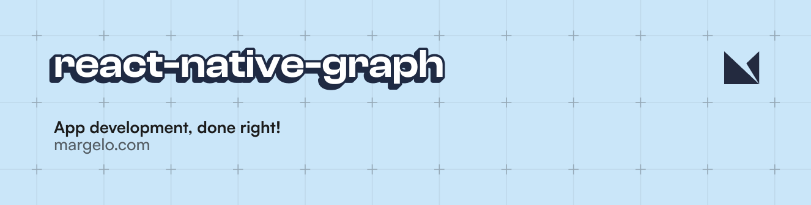
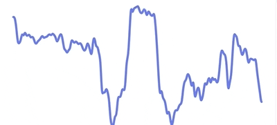
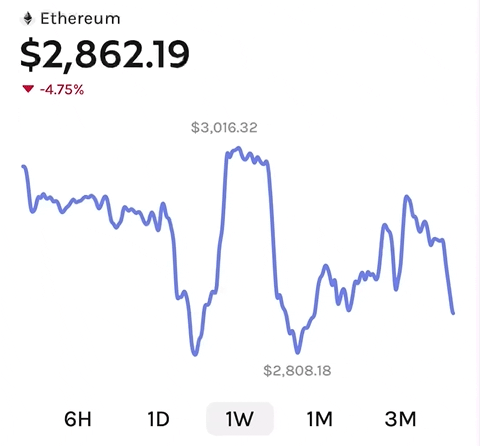
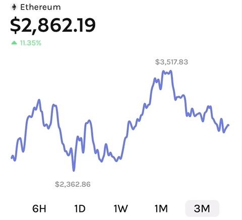
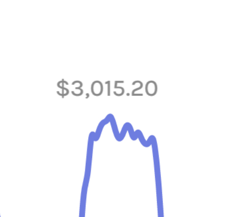
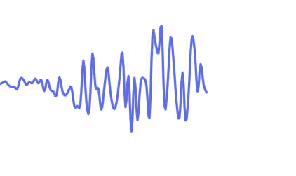
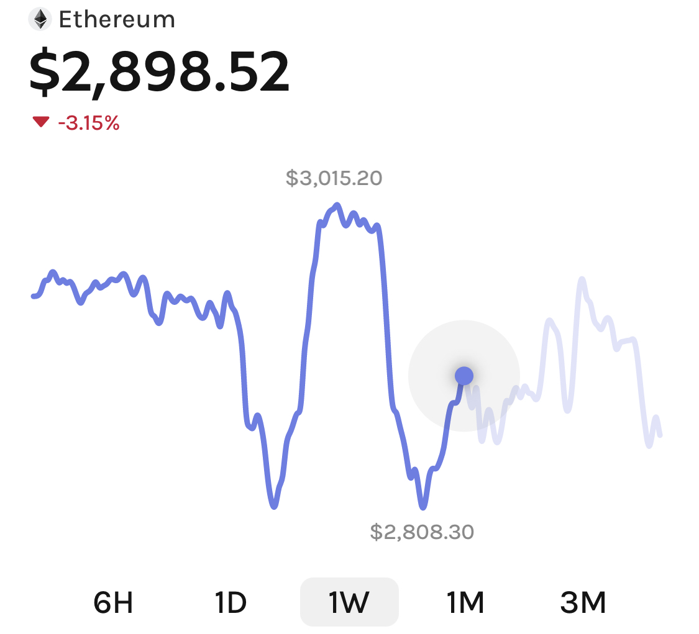

<a href="https://margelo.com">
  <picture>
    <source media="(prefers-color-scheme: dark)" srcset="./img/bg-dark.png" />
    <source media="(prefers-color-scheme: light)" srcset="./img/bg-light.png" />
    
  </picture>
</a>

<div align="center">

  <h1>
    📈 <br/>
    react-native-graph <br/> <br/>
    
  </h1>

<b>Beautiful, high-performance Graphs/Charts for React Native.</b>

</div>

## About

**react-native-graph** is a Line Graph implementation based on the high performance 2D graphics rendering engine "Skia". It's used in the [Pink Panda Wallet app](https://pinkpanda.io) to power thousands of token graphs every day.

- 🏎️ Faster and smoother than react-native-svg graphs
- ⚡️ Native path interpolation in Skia
- 🐎 Up to 120 FPS animations
- 📈 Cubic bezier rendering for smoother edges
- 👍 Smooth pan/scrubbing gesture
- 💰 Made for crypto apps and Wallets
- ❌ Does not block navigation, press or scroll animations

## Installation

<pre>
yarn add <a href="https://github.com/software-mansion/react-native-reanimated">react-native-reanimated</a> # Reanimated requires <a href="https://github.com/software-mansion/react-native-reanimated/tree/main/packages/react-native-worklets">react-native-worklets</a>
yarn add <a href="https://github.com/software-mansion/react-native-gesture-handler">react-native-gesture-handler</a>
yarn add <a href="https://github.com/Shopify/react-native-skia">@shopify/react-native-skia</a>
yarn add <b>react-native-graph</b>
</pre>

## Usage

```tsx
import { LineGraph } from 'react-native-graph';

function App() {
  const priceHistory = usePriceHistory('ethereum');

  return (
    <LineGraph
      style={{ height: 200 }}
      points={priceHistory}
      animated={false}
      color="#4484B2"
    />
  );
}
```

## Configuration

`LineGraph` accepts the following props. It also accepts React Native [`ViewProps`](https://reactnative.dev/docs/view#props), which are forwarded to the root view.

| Prop                      | Type                                       | Default                                            | Availability      | Description                                                                                                                            |
| ------------------------- | ------------------------------------------ | -------------------------------------------------- | ----------------- | -------------------------------------------------------------------------------------------------------------------------------------- |
| `animated`                | `boolean`                                  | `false`                                            | Always            | Uses the animated renderer when `true` and the lightweight static renderer when `false`.                                               |
| `points`                  | `GraphPoint[]`                             | None. Required.                                    | Always            | The points to draw. Each point contains a numeric `value` and a `Date`. The graph scales to fit them unless `range` overrides an axis. |
| `color`                   | `string`                                   | None. Required.                                    | Always            | The graph line color.                                                                                                                  |
| `range`                   | `GraphRange`                               | `undefined`. Both axes are inferred from `points`. | Always            | Overrides all or part of the visible x-axis and y-axis ranges.                                                                         |
| `gradientFillColors`      | `Color[]`                                  | `undefined`. No area fill is drawn.                | `animated={true}` | Colors for the vertical gradient below the graph line.                                                                                 |
| `lineThickness`           | `number`                                   | `3`                                                | Always            | The graph line width in points.                                                                                                        |
| `curve`                   | `'bezier' \| 'linear'`                     | `'bezier'`                                         | `animated={false}` | Uses smooth Bézier interpolation or straight point-to-point segments.                                                                  |
| `enableFadeInMask`        | `boolean`                                  | `false`                                            | Always            | Fades in the start of the graph line.                                                                                                  |
| `enablePanGesture`        | `boolean`                                  | `false`                                            | `animated={true}` | Lets the user press and scrub through graph points.                                                                                    |
| `panGestureDelay`         | `number`                                   | `300`                                              | `animated={true}` | Time in milliseconds that a press must be held before scrubbing starts. Set it to `0` to start immediately.                            |
| `onGestureStart`          | `() => void`                               | `undefined`. No callback runs.                     | `animated={true}` | Called when scrubbing starts.                                                                                                          |
| `onPointSelected`         | `(point: GraphPoint) => void`              | `undefined`. No callback runs.                     | `animated={true}` | Called when scrubbing reaches a different point.                                                                                       |
| `onGestureEnd`            | `() => void`                               | `undefined`. No callback runs.                     | `animated={true}` | Called when scrubbing ends.                                                                                                            |
| `SelectionDot`            | `ComponentType<SelectionDotProps> \| null` | Built-in `SelectionDot`                            | `animated={true}` | Renders the current scrub position. Pass `null` to hide it.                                                                            |
| `selectionDotShadowColor` | `string`                                   | `undefined`                                        | `animated={true}` | Currently unused. This prop has no visual effect.                                                                                      |
| `horizontalPadding`       | `number`                                   | `10` when the indicator is enabled, otherwise `0`  | `animated={true}` | Adds space to both horizontal edges of the drawing area.                                                                               |
| `verticalPadding`         | `number`                                   | The value of `lineThickness`                       | `animated={true}` | Adds space to both vertical edges of the drawing area.                                                                                 |
| `enableIndicator`         | `boolean`                                  | `false`                                            | `animated={true}` | Shows an indicator at the last graph point.                                                                                            |
| `indicatorPulsating`      | `boolean`                                  | `false`                                            | `animated={true}` | Pulses the indicator while the graph is idle. Requires `enableIndicator`.                                                              |
| `TopAxisLabel`            | `() => ReactElement \| null`               | `undefined`. Nothing is rendered.                  | `animated={true}` | Renders a label above the graph.                                                                                                       |
| `BottomAxisLabel`         | `() => ReactElement \| null`               | `undefined`. Nothing is rendered.                  | `animated={true}` | Renders a label below the graph.                                                                                                       |

### Data types

```ts
interface GraphPoint {
  value: number;
  date: Date;
}

interface GraphRange {
  x?: { min: Date; max: Date };
  y?: { min: number; max: number };
}
```

You can provide either axis in `range` and let the graph infer the other one from `points`.

## Prop examples

### `animated`



Whether to animate between data changes. Defaults to `false` when omitted.

Animations run using the [Skia animation system](https://shopify.github.io/react-native-skia/docs/animations/animations), with path interpolation handled on the UI thread.

If `animated` is `false`, the graph uses a lightweight static renderer. This is useful when displaying many graphs in a list.

Example:

```jsx
<LineGraph points={priceHistory} animated={true} color="#4484B2" />
```

---

### `enablePanGesture`



Whether to enable the pan gesture. Defaults to `false`.

> Requires `animated` to be `true`.

There are three events fired when the user interacts with the graph:

1. `onGestureStart`: Fires once the user presses and holds the graph. The pan gesture activates.
2. `onPointSelected`: Fires for each point the user pans through. Use it to update a label or highlight the selected value.
3. `onGestureEnd`: Fires once the user releases the graph. The pan gesture deactivates.

The pan gesture can be configured using these props:

- `panGestureDelay` controls how long the user must hold before the gesture activates. It defaults to `300` milliseconds. Set it to `0` to start immediately.

Example:

```jsx
<LineGraph
  points={priceHistory}
  animated={true}
  color="#4484B2"
  enablePanGesture={true}
  onGestureStart={() => hapticFeedback('impactLight')}
  onPointSelected={(p) => updatePriceTitle(p)}
  onGestureEnd={() => resetPriceTitle()}
/>
```

---

### `TopAxisLabel` / `BottomAxisLabel`



Renders labels above or below the graph. Both props default to `undefined`, so no labels are rendered.

> Requires `animated` to be `true`.

These labels usually show the maximum and minimum values. You can derive those values and their positions from the graph points.

Example:

```jsx
<LineGraph
  points={priceHistory}
  animated={true}
  color="#4484B2"
  TopAxisLabel={() => <AxisLabel x={max.x} value={max.value} />}
  BottomAxisLabel={() => <AxisLabel x={min.x} value={min.value} />}
/>
```

### `range`



Defines the visible range of the graph canvas. It defaults to `undefined`, which infers both axes from `points`.

Use a custom range to show a fixed time frame or value scale, even when the data does not cover the whole range. Points outside the x-axis range are not drawn.

<br />
<br />

This example shows January 2000 and sets the y-axis range to 0 through 200:

```jsx
<LineGraph
  points={priceHistory}
  animated={true}
  color="#4484B2"
  enablePanGesture={true}
  range={{
    x: {
      min: new Date('2000-01-01T00:00:00.000Z'),
      max: new Date('2000-01-31T23:59:59.999Z'),
    },
    y: {
      min: 0,
      max: 200,
    },
  }}
/>
```

---

### `SelectionDot`



Renders the selection dot. It defaults to the built-in `SelectionDot`. Pass `null` to hide it.

> Requires `animated` and `enablePanGesture` to be `true`.

A custom selection-dot component receives these props from `LineGraph`. They are all required and have no defaults when you render `SelectionDot` directly.

| Prop            | Type                   | Default         | Description                                                 |
| --------------- | ---------------------- | --------------- | ----------------------------------------------------------- |
| `isActive`      | `SharedValue<boolean>` | None. Required. | Whether the pan gesture is active.                          |
| `color`         | `string`               | None. Required. | The graph line color.                                       |
| `lineThickness` | `number \| undefined`  | None. Required. | The resolved graph line width when supplied by `LineGraph`. |
| `circleX`       | `SharedValue<number>`  | None. Required. | The selected point's x-coordinate.                          |
| `circleY`       | `SharedValue<number>`  | None. Required. | The selected point's y-coordinate.                          |

Example:

```jsx
<LineGraph
  points={priceHistory}
  animated={true}
  color="#4484B2"
  enablePanGesture={true}
  SelectionDot={CustomSelectionDot}
/>
```

See this [example `<SelectionDot />` component](./example/src/components/CustomSelectionDot.tsx).

## Sponsor


**react-native-graph** is sponsored by [Pink Panda](https://pinkpanda.io).

Download the Pink Panda mobile app to see react-native-graph in action!

## Community Discord

[Join the Margelo Community Discord](https://discord.gg/6CSHz2qAvA) to chat about react-native-graph or other Margelo libraries.

## Adopting at scale

react-native-graph was built at Margelo, an elite app development agency. For enterprise support or other business inquiries, contact us at <a href="mailto:hello@margelo.com?subject=Adopting react-native-graph at scale">hello@margelo.com</a>!

## Thanks

Special thanks to [William Candillon](https://github.com/wcandillon) and [Christian Falch](https://github.com/chrfalch) for their amazing help and support for React Native Skia ❤️
